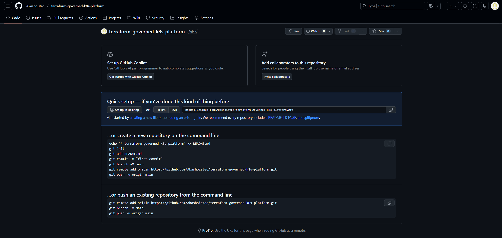
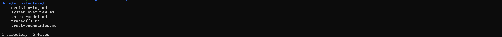
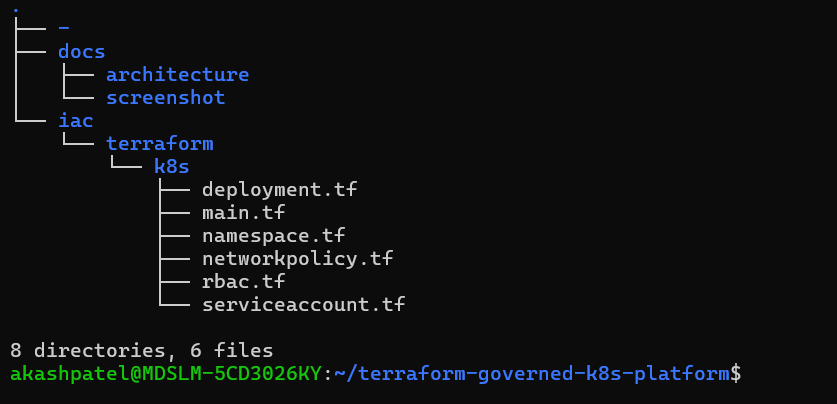

# Terraform-Governed Kubernetes Platform (Governance-First DevSecOps Case Study)

---

## 📌 What This Is

This repository is a **governance-first, end-to-end, Terraform-governed Kubernetes platform** implemented as a portfolio-grade case study.

It demonstrates how to design and operate a system where:

- Git is the **only control plane for change**
- CI/CD is the **decision and enforcement engine**
- Terraform is the **state and governance authority**
- Kubernetes is the **runtime reconciliation engine**

Humans do **not** directly apply infrastructure or workloads.

All changes flow through:

---

## 🗂️ How To Read This Repository

If you are a reviewer:

1. Start with this README
2. Then read:
   - `docs/architecture/system-overview.md`
   - `docs/architecture/trust-boundaries.md`
   - `docs/architecture/threat-model.md`
3. Then inspect:
   - `iac/terraform/k8s/`
4. Finally:
   - Look at `.github/workflows/` to see how governance is enforced

---

## 🎯 What Problem This Solves

Most “DevSecOps” implementations focus on **tools and automation**.

This project focuses on:

- Governance
- Control planes
- Trust boundaries
- Blast radius reduction
- Change control
- State authority

It answers the question:

> “How do you design a platform where **the system**, not humans, enforces security and consistency?”

---

## 🏗️ System Architecture (Conceptual)

High-level control flow:

Each layer has a **clear responsibility and trust boundary**.

---

## 📐 Detailed Design Documents

- [System Overview](docs/architecture/system-overview.md)
- [Trust Boundaries](docs/architecture/trust-boundaries.md)
- [Threat Model](docs/architecture/threat-model.md)
- [Trade-offs & Limitations](docs/architecture/tradeoffs.md)
- [Architectural Decision Log](docs/architecture/decision-log.md)

---

## 🧠 Design Principles

- Git is the **single source of truth**
- No manual `kubectl apply` or `terraform apply`
- CI/CD is the **only execution path**
- Terraform owns **desired state**
- Kubernetes enforces **actual state**
- Security is enforced by **system design**, not by process

---

## 🔐 Security & Governance Model

This platform demonstrates:

- Namespace-level isolation
- ServiceAccount + RBAC scoping
- Workload hardening:
  - Non-root
  - Read-only filesystem
  - Dropped Linux capabilities
  - Resource limits
  - Explicit volumes
- NetworkPolicy (intent)
- Immutable, auditable change flow

---

## ⚠️ Explicit Limitations (By Design)

This is a **local, kind-based cluster** used to demonstrate:

- Architecture
- Control flow
- Governance mechanics

Therefore:

- NetworkPolicy is intent-only (kindnet)
- No cloud IAM
- No admission controller
- No policy engine (OPA/Kyverno)
- No secrets manager
- No multi-cluster or multi-tenant isolation

All of these are **documented trade-offs**, not oversights.

---

## 📂 Repository Structure

---

## 🧪 What This Project Demonstrates

- How to turn **architecture into enforcement**
- How to make **Git the real control plane**
- How to design **governed delivery**, not just pipelines
- How to reduce blast radius by **construction**, not detection

---

## 📸 Evidence & Build Log

This repository includes **evidence screenshots** of key milestones:

- Repository creation
- Structure setup
- Architecture documentation
- CI/CD runs (later)
- Terraform plan & apply from pipeline (later)
- Kubernetes rollout (later)

These are stored in:

---

## 👤 About the Author

## 👤 About the Author

This project is built from the perspective of a security-first platform engineering mindset.

It reflects:

- A strong bias toward governance and control planes
- Experience with real-world security failures and operational risk
- A focus on designing systems that are secure **by construction**, not by process

This is not a tool showcase.

It is a **system design and governance case study**.

<!-- pipeline -->
